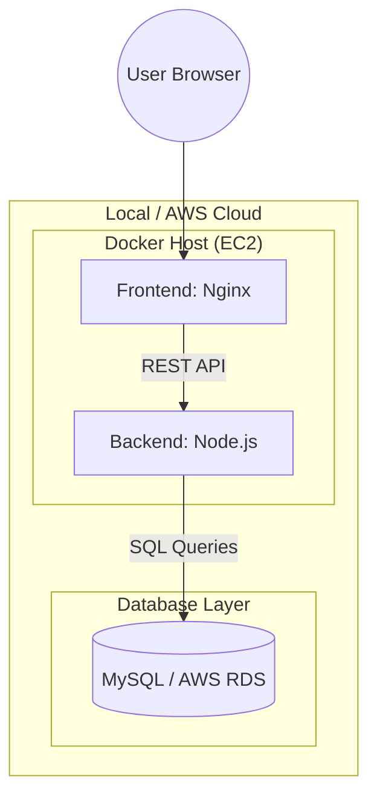
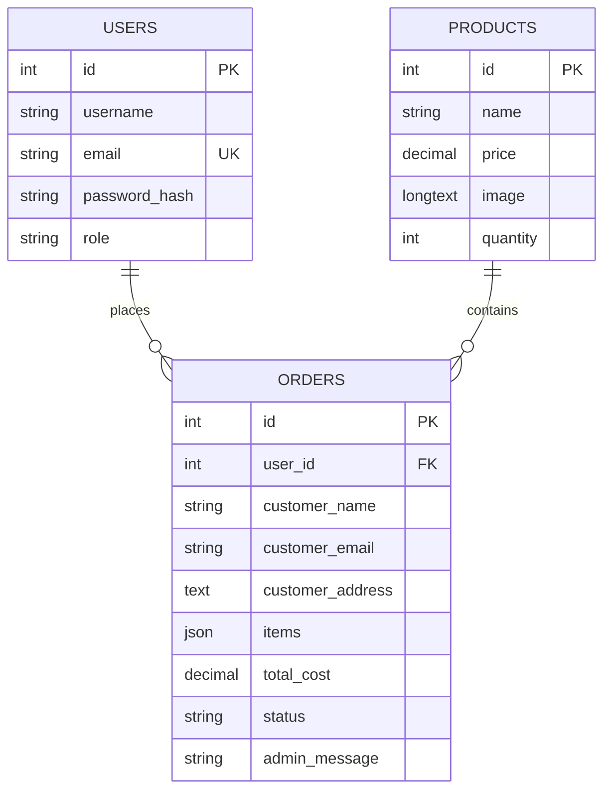

# Bakery Web Application - Containerized DevOps Project

This repository contains a professional full-stack Bakery Web Application, containerized with Docker and ready for deployment on AWS (EC2 & RDS). It features a Node.js backend, a responsive Nginx-powered frontend, and a MySQL database.

---

## 🚀 New Features (Latest Update)
- **User Authentication**: Complete Register/Login flow for customers with password hashing using `bcryptjs`.
- **Admin Dashboard**: Secure admin portal (`admin`/`admin123`) to manage products (add/edit/delete with images) and update customer order statuses.
- **Database Integration**: Fully integrated with MySQL using `mysql2`. All products, users, orders, and messages are stored persistently.
- **INR Pricing**: All product prices and calculations are updated to **Indian Rupees (₹)**.
- **Dummy QR Payment**: Integrated a simulated QR code payment gateway with a 10-second processing delay.
- **Order Tracking**: Customers can track their order status and see admin notes in real-time.

---

## 🛠️ Technical Architecture
The application uses a multi-container Docker architecture.



---

## 📊 Database Schema (ER Diagram)
The database stores information about users, products, orders, and contact inquiries.



---

## 💻 Local Setup Instructions

### 1. Prerequisites
- **Docker Desktop** installed and running.
- **MySQL Workbench** (optional, for database verification).

### 2. Database Initialization
If running for the first time, you can initialize your local MySQL or let Docker handle it. The project is configured to use port **3307** locally to avoid conflicts with existing MySQL installations.

### 3. Run with Docker Compose
Navigate to the `Containerized Bakery Web Application` directory and run:
```bash
docker-compose up --build -d
```

### 4. Access the App
- **Frontend**: [http://localhost](http://localhost)
- **User Login/Register**: [http://localhost/employee_login.html](http://localhost/employee_login.html)
- **Admin Portal**: [http://localhost/admin_login.html](http://localhost/admin_login.html)
  - *Default Admin*: `admin` / `admin123`
- **Backend API**: [http://localhost:8080](http://localhost:8080)

---

## ☁️ AWS Deployment Plan
1. **RDS**: Create a MySQL instance and run `bakery_schema.sql`.
2. **EC2**: Launch a t2.micro instance, install Docker, and clone this repo.
3. **Environment**: Update `DB_HOST`, `DB_USER`, and `DB_PASS` in `docker-compose.yml` with RDS endpoints.
4. **Launch**: Run `docker-compose up -d` on the EC2 instance.
